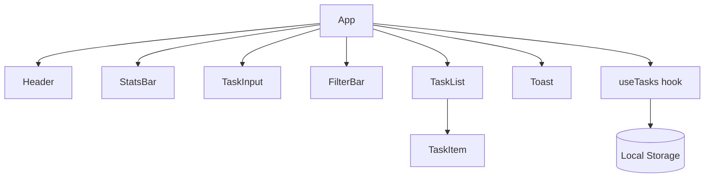

# Momentum — React Task Manager

Momentum is a responsive task manager developed with Create React App for an internship assignment on introductory React.js. It demonstrates component-based design, JSX, props, event handling, state, effects, reusable components, CRUD operations, filtering, sorting, validation, and browser persistence.

## Project objectives

- Build a practical single-page application with React.
- Implement Create, Read, Update, and Delete operations.
- Use `useState` for interface and task state.
- Use `useEffect` to synchronize tasks with Local Storage.
- Pass data and event callbacks through props.
- Create small, reusable components with clear responsibilities.
- Provide responsive, accessible UI and useful validation.
- Test important business logic and user workflows.

## Main features

- Add tasks with title, description, category, priority, and due date.
- Edit, delete, complete, and reopen tasks.
- Search task titles and descriptions.
- Filter by All, Active, Completed, and category.
- Sort by newest, oldest, due date, priority, and alphabetical order.
- Display total, active, completed, and completion percentage statistics.
- Highlight overdue tasks.
- Save every change to Local Storage.
- Show clear empty states, validation messages, and success notifications.
- Adapt to desktop, tablet, and mobile screens.
- Support keyboard focus and reduced-motion preferences.

## Technology stack

- React 18
- Create React App / `react-scripts`
- JavaScript ES6+
- CSS3 with responsive media queries and animations
- Web Storage API (Local Storage)
- Jest and React Testing Library

## Required project structure

```text
react-task-manager/
├── public/
│   ├── index.html
│   └── manifest.json
├── screenshots/
│   ├── desktop-dashboard.png
│   ├── desktop-add-task-form.png
│   └── mobile-dashboard.png
├── src/
│   ├── components/
│   │   ├── FilterBar.js
│   │   ├── Header.js
│   │   ├── StatsBar.js
│   │   ├── TaskInput.js
│   │   ├── TaskItem.js
│   │   ├── TaskList.js
│   │   └── Toast.js
│   ├── data/starterTasks.js
│   ├── hooks/useTasks.js
│   ├── utils/
│   │   ├── taskUtils.js
│   │   └── taskUtils.test.js
│   ├── App.css
│   ├── App.js
│   ├── App.test.js
│   ├── index.css
│   ├── index.js
│   └── setupTests.js
├── .gitignore
├── package.json
└── README.md
```

## Component architecture



`App` is the container component. It owns filter, form, edit, and notification state. The custom `useTasks` hook owns the task collection and exposes task actions. Presentation components receive values and callbacks through props, while Local Storage remains isolated inside the hook.

## Data flow

1. The user submits `TaskInput`.
2. `TaskInput` validates the title and sends form values to `App` through `onSubmit`.
3. `App` calls `addTask` or `updateTask` from `useTasks`.
4. React updates the `tasks` state and renders affected components.
5. The hook's `useEffect` serializes the new array with `JSON.stringify()`.
6. Local Storage saves the value under `momentum-react-tasks-v1`.
7. On the next visit, a lazy state initializer reads and parses the saved JSON.

## React concepts used

### JSX and components

The interface is written with JSX. Components separate the dashboard into focused units. Repeated tasks are rendered with `tasks.map()`, and every `TaskItem` receives a stable `key` based on its task ID.

### Props

Parent components pass data and callback functions as props. For example, `TaskList` sends a single task plus `onToggle`, `onEdit`, and `onDelete` handlers to each `TaskItem`. This creates one-way data flow.

### `useState`

`useState` stores tasks, form visibility, the task being edited, filters, and toast messages. Functional state updates such as `setTasks(current => ...)` prevent logic from depending on stale state.

### `useEffect`

The persistence effect runs whenever `tasks` changes:

```js
useEffect(() => {
  localStorage.setItem(STORAGE_KEY, JSON.stringify(tasks));
}, [tasks]);
```

Another effect in the form moves keyboard focus to the title field when it opens. The toast effect starts a timer and returns a cleanup function.

### Event handling

The application handles form submission, text input, select changes, checkbox changes, button clicks, and search events. Event handlers update state rather than manipulating the DOM directly.

### Derived state with `useMemo`

Statistics and the filtered/sorted task list are derived from the task and filter state. `useMemo` avoids repeating this calculation on unrelated renders.

## Task data structure

```json
{
  "id": "1721550000000-0.1234",
  "title": "Submit React assignment",
  "description": "Upload source code, report and screenshots",
  "category": "Work",
  "priority": "High",
  "dueDate": "2026-07-25",
  "completed": false,
  "createdAt": "2026-07-21T10:00:00.000Z",
  "updatedAt": "2026-07-21T10:00:00.000Z"
}
```

Tasks are stored in an array. Immutable methods—spread syntax, `map`, and `filter`—create new arrays or objects so React can detect state changes.

## Algorithm summary

| Operation | Technique | Time complexity |
|---|---|---:|
| Add | Create object and prepend to array | O(n) |
| Update | `map()` and replace matching ID | O(n) |
| Delete | `filter()` by ID | O(n) |
| Toggle | `map()` and invert `completed` | O(n) |
| Filter/search | One pass through tasks | O(n) |
| Sort | Copy then JavaScript `sort()` | O(n log n) |
| Statistics | Count completed tasks | O(n) |

For a personal task manager, these algorithms are simple, readable, and efficient for the expected data size.

## Installation and setup

### Prerequisites

- Node.js 18 or later
- npm 9 or later
- VS Code or another editor
- A modern web browser

### Run locally

1. Extract the project ZIP.
2. Open the `react-task-manager` folder in VS Code.
3. Open a terminal in that folder.
4. Install packages:

   ```bash
   npm install
   ```

5. Start the development server:

   ```bash
   npm start
   ```

6. Open `http://localhost:3000` if the browser does not open automatically.

### Windows CMD example

```cmd
cd /d "D:\React Assignment\react-task-manager"
npm install
npm start
```

## Testing

Run the automated test suite once:

```bash
npm run test:ci
```

The tests validate task creation, title normalization, status filters, category filters, search, five sorting paths, statistics, overdue rules, date formatting, dashboard rendering, add-and-persist behavior, empty-title validation, and completed-task filtering.

### Manual validation checklist

| ID | Test scenario | Expected result |
|---|---|---|
| MT-01 | Submit a valid task | New task appears at the top and a success message displays |
| MT-02 | Submit only spaces as title | Form stays open and displays validation feedback |
| MT-03 | Edit a task | Existing card updates without creating a duplicate |
| MT-04 | Complete and reopen a task | Checkbox and completed styling update correctly |
| MT-05 | Delete a task | The matching task disappears |
| MT-06 | Search title or description | Only matching tasks remain visible |
| MT-07 | Filter Active/Completed | List displays the selected status only |
| MT-08 | Filter a category | Only that category remains visible |
| MT-09 | Change sort order | Cards reorder according to the selected rule |
| MT-10 | Refresh the browser | Tasks remain available from Local Storage |
| MT-11 | Use a mobile-width screen | Layout stacks without horizontal overflow |
| MT-12 | Navigate with keyboard | Controls show focus and work without a mouse |

## Production build

```bash
npm run build
```

The optimized files are written to the `build` folder.

## Deployment

### Netlify

1. Push the project to GitHub.
2. In Netlify, choose **Add new site → Import an existing project**.
3. Select the GitHub repository.
4. Set the build command to `npm run build`.
5. Set the publish directory to `build`.
6. Deploy the site and test the public URL.

### Vercel

1. Import the GitHub repository into Vercel.
2. Keep the detected Create React App settings.
3. Confirm the build command is `npm run build` and output directory is `build`.
4. Select **Deploy** and verify the result.

## GitHub submission process

```bash
git init
git add .
git commit -m "Complete React task manager internship project"
git branch -M main
git remote add origin https://github.com/YOUR_USERNAME/react-task-manager.git
git push -u origin main
```

Before submitting, confirm that `node_modules`, `build`, and `coverage` are not committed. Include the repository link, live deployment link, report, and screenshots in the internship portal.

## Accessibility and responsive design

- Semantic headings, sections, form labels, and buttons are used.
- Status messages use `role="status"` and form errors use `role="alert"`.
- Search has an accessible label, checkboxes explain their actions, and filter tabs expose pressed state.
- Visible focus styles support keyboard users.
- A skip link moves directly to the task list.
- `prefers-reduced-motion` removes nonessential motion.
- Media queries optimize layouts below 900 px and 680 px.

## Limitations

- Local Storage is specific to one browser and device.
- There is no authentication or cloud synchronization.
- Clearing browser site data removes saved tasks.
- The application is designed for personal-scale task collections.

## Future enhancements

- User login and a database-backed API
- Drag-and-drop ordering
- Recurring tasks and reminders
- Calendar view
- Dark theme
- Export/import backup
- Collaborative task sharing
- Offline Progressive Web App support

## Submission checklist

- [x] Create React App-compatible project
- [x] Add, read, edit, delete, complete, and reopen tasks
- [x] `useState` and `useEffect`
- [x] Filtering, sorting, search, categories, and priorities
- [x] Local Storage persistence
- [x] Reusable components and one-way props
- [x] Responsive CSS and animations
- [x] Accessibility features
- [x] Automated and manual testing evidence
- [x] Component hierarchy and data-flow explanation
- [x] Setup, GitHub, build, and deployment instructions
- [x] Desktop and mobile screenshots

## Author details

- Student name: MANOJ KUMAR
- Enrollment number: EMP20260610-7776
